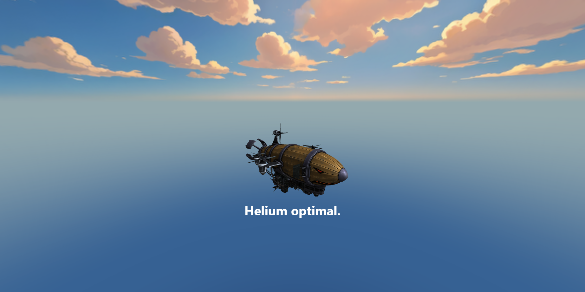

# Dự án Trình diễn 3D với Hiệu ứng Cuộn Chuột

Đây là một dự án web demo, trình diễn cách sử dụng các công nghệ web hiện đại để tạo ra một trang web tương tác, nơi người dùng có thể điều khiển một hoạt cảnh 3D bằng cách cuộn chuột. Dự án này lấy cảm hứng từ các trang giới thiệu sản phẩm của Apple hoặc các trang web portfolio sáng tạo.


## Công nghệ sử dụng

*   **HTML5 / CSS3:** Cấu trúc và giao diện cơ bản của trang web.
*   **Three.js:** Một thư viện JavaScript mạnh mẽ để tạo và hiển thị đồ họa 3D trong trình duyệt.
*   **GSAP (GreenSock Animation Platform):** "Tiêu chuẩn vàng" trong ngành cho các hiệu ứng chuyển động (animation) hiệu suất cao trên web.
*   **ScrollTrigger:** Một plugin của GSAP, dùng để kích hoạt các animation dựa trên vị trí của thanh cuộn.

## Hướng dẫn Cài đặt và Chạy

Để chạy dự án này trên máy của bạn, bạn cần một máy chủ web cục bộ (local server) để trình duyệt có thể tải tệp mô hình 3D (`.glb`).

**Cách đơn giản nhất là sử dụng Visual Studio Code và tiện ích "Live Server":**

1.  **Clone hoặc tải về** toàn bộ mã nguồn của dự án này.
2.  Mở thư mục dự án bằng **Visual Studio Code**.
3.  Trong VS Code, vào tab Tiện ích (Extensions) và tìm kiếm `Live Server`, sau đó cài đặt nó.
4.  Sau khi cài đặt xong, chuột phải vào tệp `index.html` trong cây thư mục và chọn **"Open with Live Server"**.
5.  Trang web sẽ tự động mở trong trình duyệt của bạn và mọi thứ sẽ hoạt động!

## Giải thích chi tiết `script.js`

Tệp `script.js` là "bộ não" của toàn bộ dự án. Nó được chia thành 4 phần chính:

### 1. Thiết lập Cảnh 3D (Three.js)

Phần này khởi tạo các thành phần cơ bản để có thể hiển thị một vật thể 3D:

*   `const scene = new THREE.Scene();`: Tạo ra một "sân khấu" để chứa tất cả các đối tượng, mô hình, và ánh sáng.
*   `const camera = new THREE.PerspectiveCamera(...)`: Tạo ra một "máy quay" ảo. Đây là góc nhìn của người dùng vào sân khấu.
    *   **`camera.position.set(x, y, z)`**: Đặt vị trí ban đầu của máy quay. **Đây là thuộc tính quan trọng nhất để điều chỉnh góc nhìn ban đầu (ra xa, lại gần, cao, thấp).**
*   `const renderer = new THREE.WebGLRenderer(...)`: Tạo ra "họa sĩ", người sẽ lấy hình ảnh từ `camera` và vẽ nó lên thẻ `<canvas>` trong HTML.
*   `const ambientLight = ...`, `const directionalLight = ...`: Tạo ra các nguồn "ánh sáng" ảo. Nếu không có ánh sáng, mô hình sẽ có màu đen kịt.

### 2. Tải Mô hình 3D

Phần này sử dụng `GLTFLoader` của Three.js để tải tệp mô hình `.glb` vào sân khấu:

```javascript
loader.load(
    'path/to/your/model.glb', // Đường dẫn tới tệp
    function (gltf) {
        // Hàm này sẽ được gọi KHI mô hình tải XONG
        model = gltf.scene;
        scene.add(model); // Thêm mô hình vào sân khấu
        setupScrollAnimation(); // QUAN TRỌNG: Chỉ chạy animation sau khi mô hình đã sẵn sàng
    }
);
```
Trong hàm callback này, chúng ta có thể điều chỉnh vị trí, kích thước, và hướng xoay ban đầu của mô hình bằng các thuộc tính:
*   `model.position.set(x, y, z)`
*   `model.scale.set(x, y, z)`
*   `model.rotation.set(x, y, z)`

### 3. "Phép thuật" của GSAP và ScrollTrigger

Đây là trái tim của hiệu ứng. Chúng ta tạo ra một chuỗi các animation và "gắn" nó vào thanh cuộn.

*   `gsap.registerPlugin(ScrollTrigger);`: Đăng ký để có thể sử dụng plugin ScrollTrigger.
*   `const tl = gsap.timeline({...});`: Tạo một **Timeline**, là một chuỗi các animation sẽ diễn ra tuần tự.

Phần quan trọng nhất là đối tượng cấu hình `scrollTrigger`:

```javascript
scrollTrigger: {
    trigger: 'main',           // Kích hoạt khi phần tử <main> vào màn hình
    start: 'top top',        // Bắt đầu animation khi đỉnh của <main> chạm đỉnh màn hình
    end: 'bottom bottom',      // Kết thúc animation khi đáy của <main> chạm đáy màn hình
    scrub: 1,                  // Điểm mấu chốt!
    markers: false             // Đặt là `true` để hiện các vạch đánh dấu khi debug
}
```

**`scrub` là gì?** Đây là thuộc tính kỳ diệu nhất:
*   Nếu không có `scrub`, animation sẽ chạy một lần duy nhất khi bạn cuộn đến điểm `start`.
*   Khi có `scrub: true` (hoặc một con số như `1` để mượt hơn), tiến trình của animation sẽ được **kết nối trực tiếp** với vị trí của thanh cuộn. Bạn cuộn xuống, animation chạy tới. Bạn cuộn lên, animation chạy ngược lại.

Sau khi tạo timeline, chúng ta thêm các animation vào đó bằng phương thức `.to()`:

```javascript
// .to(đối_tượng, { thuộc_tính_muốn_thay_đổi })
tl
    .to(camera.position, { z: 30, y: 10 })
    .to(camera.position, { x: -25 })
    .to(airshipModel.rotation, { y: Math.PI }, "<"); // "<" có nghĩa là chạy CÙNG LÚC với animation trước đó
```
Mỗi dòng `.to()` là một bước trong chuỗi animation. GSAP sẽ tự động tính toán và làm cho các chuyển động trở nên mượt mà.

### 4. Vòng lặp Render

Hàm `animate()` là một vòng lặp vô tận, được gọi liên tục khoảng 60 lần mỗi giây.

```javascript
function animate() {
    requestAnimationFrame(animate);
    renderer.render(scene, camera);
}
```
Nhiệm vụ của nó rất đơn giản: "Mỗi frame, hãy vẽ lại sân khấu (`scene`) từ góc nhìn của máy quay (`camera`)". Điều này đảm bảo rằng mọi thay đổi về vị trí/xoay của camera hoặc mô hình (do GSAP điều khiển) sẽ được hiển thị ngay lập tức trên màn hình.



## Tùy chỉnh Dự án

Bạn có thể dễ dàng biến dự án này thành của riêng mình:

1.  **Để thay đổi mô hình 3D:**
    *   Đặt tệp `.glb` của bạn vào thư mục dự án (hoặc thư mục con `models`).
    *   Thay đổi đường dẫn trong hàm `loader.load(...)`.
    *   Tinh chỉnh `position`, `scale`, `rotation` của mô hình mới trong hàm callback để có góc nhìn ban đầu đẹp nhất.

2.  **Để thay đổi kịch bản animation:**
    *   Chỉnh sửa các giá trị trong các dòng `.to(...)` bên trong hàm `setupScrollAnimation()`.
    *   Thêm hoặc bớt các dòng `.to(...)` để tạo ra một câu chuyện chuyển động hoàn toàn mới. Thỏa sức sáng tạo